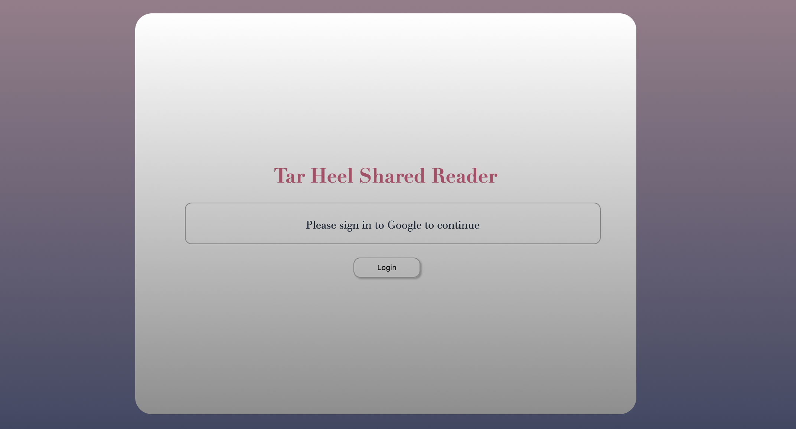
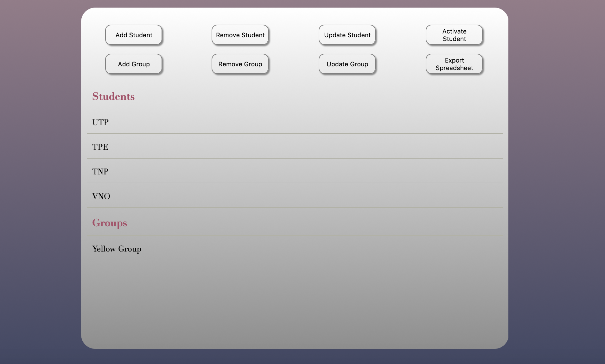
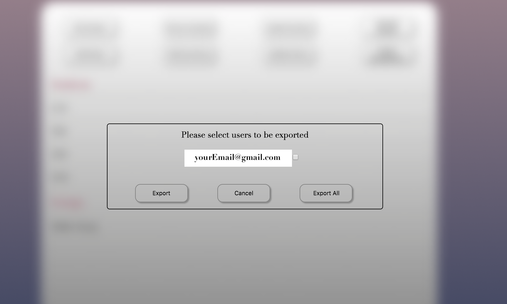

# Exporting Spreadsheets

This tutorial will show you how to export user activity from the Tar Heel Shared Reading interface, if you have administrative privileges. The user activity includes various events that are registered in the database, and the events are discussed in detail in this tutorial. 

## Gaining Adminstrative Privileges
Only known administrators have the ability to access user activity on the Tar Heel Shared Reading interface. To gain administrative privileges, you must be a known user and be marked with administrative privileges in the database of all users. The only way to gain adminstrative privileges is to ask the developers of the Tar Heel Shared Reader interface. 

## User Events 
**Usage Summary**

The following is a description of the 'Usage Summary' section of the spreadsheet. 

* Email - the email of the teacher 
* Last Active Teacher - the last time the teacher used the shared reading interface 
* Number Students - the number of students the user has stored in the database at the time of exporting the spreadsheet
* Number Groups - the number of groups the user has stored in the database at the time of exporting the spreadsheet 
* Number Events - the total number of events registered by users at the time of exporting the spreadsheet. Below are the actual events that are recorded and summarized. 

* Number Books Opened - the total number of books opened, not read, using the interface.
* Number Books Read - the total number of books that one has finished reading using the interface. 
* Number Pages Read - the total number of pages read using the interface. 
* Number Start Reading Events - the total number of times the user started reading a book. 
* Number Finish Reading Events - the total number of times the user finished reading a book. Finishing a book means reading till the end of the book, that is, the last page. 
* Number Response Events - the total number of times a user has pressed a response while reading a book in the reading interface. For instance, if the user presses 'Hello,' the word 'Hello' is recorded as a response event. 
* Number Turn Page Events - the total number of turn page events. A turn page event is defined as either flipping the page forward or backwards. 
* Number Page Number Events - the total number of times a new page number event is registered. That is, when a person opens a book to page 1, an event is fired. Also, when a user turns a page the event is also fired. 

**User Activity**

The following is a description of the five main types of events that are recorded in the database. Each event is made of four main components: Email, Student Initials, Book, and Event. Email is the email of the person who performed an event on the interface. Student Initials (Student ID) is the initial of the student who is using the shared reading interface alongside the instructor. Book is the title of the book being read. Lastly, Event is the actual event that occurred. 

There are five types of events: START READING, FINISH READING, TURN PAGE, PAGE NUMBER, and RESPONSE. 

* START READING - the user has opened up a book to start reading.
* FINISH READING - the user has finished reading a book by reading up till the end of the book, that is, after the last page. 
* TURN PAGE - the user has either proceeded to the next page or flipped a page back. 
* PAGE NUMBER <em> currentPageNumber</em> - each time a book is opened or the page is flipped forward or backwards, a page number event is registered. A page number event includes the page number that was turned to at the time of occurrence. 
* RESPONSE <em> responseWord </em> - the word the student/teacher chose to respond to a particular reading page. 

## Exporting User Activity 
An administrator has the option to export the events of users in the database after logging into the Tar Heel Shared Reader interface. One has the option to select a few users from the database to export, or export all the users at once. The output will be a spreadsheet file in CSV format. Below are step-by-step directions on how to export user activity from the database. 

### Step 1 - Sign In
Sign in to your registered Gmail account using the 'Login' button in the sign in page. As a friendly reminder, only registered users have access to the shared reading interface.  

### Step 2 - Export Spreadsheet
Once you have logged into to the Tar Heel Shared Reader interface, you have the option to export user activity. Click on the 'Export Spreadsheet' button at the top right.

 

### Step 3 - Choose Users to Export
A popup will appear, asking you to choose which emails (which teachers) to export. Select the ones you want to export and click the 'Export' button. Otherwise, select to export them all by clicking the 'Export All' button.

### Step 4 - Download Spreadsheet
Once you have pressed the 'Export' or 'Export All' button, your broswer will download a spreadsheet file of the selected users' activity on the shared reading interface. It is exported as a CSV file, which can be opened using Excel.

For each user selected, a usage summary is displayed starting at the top of the spreadsheet. Below the usage summary is a list of all user activities of both users. Refer to the section above labeled 'Defining User Events' for more information about what each event means. 

## Privacy
The name of students is not stored in the database. The teacher can only store the student's initials using the shared reading interface. For each event, the students initials are outputted. That means that the spreadsheet being exported only has the initials of students for each event. 